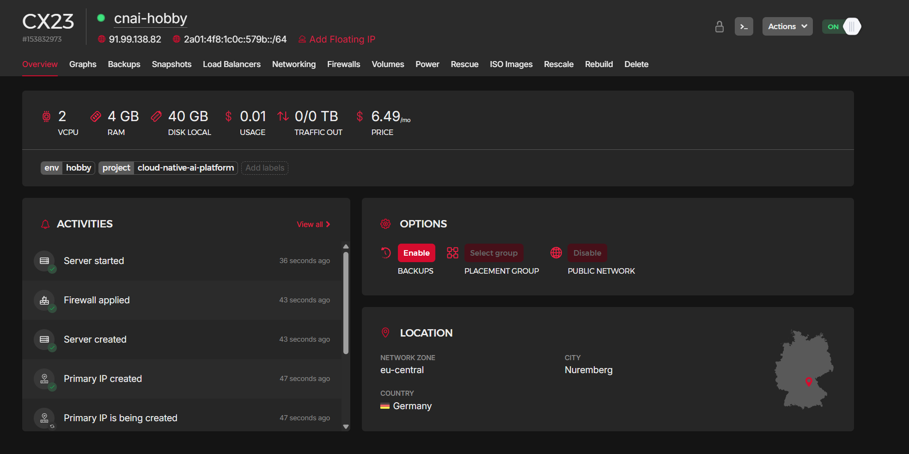
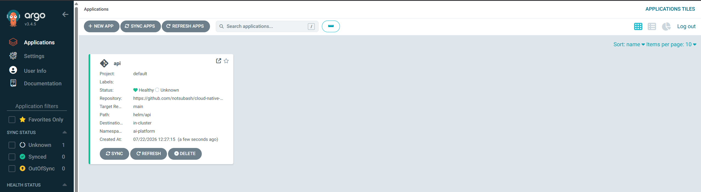
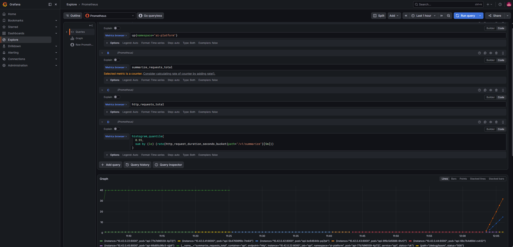
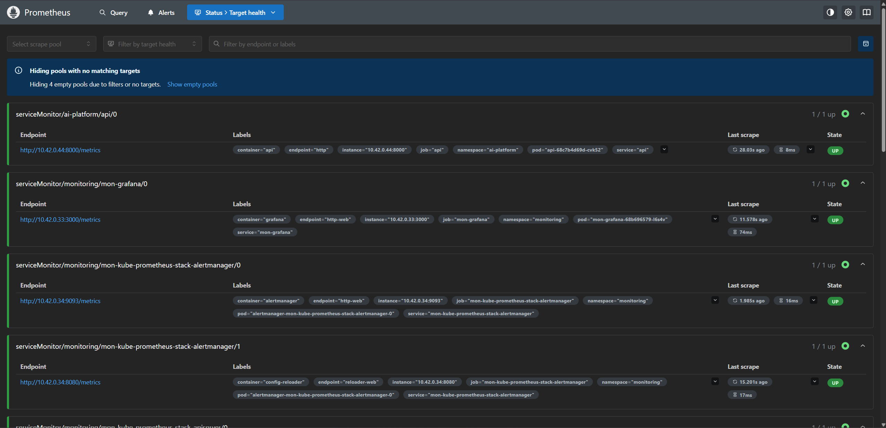
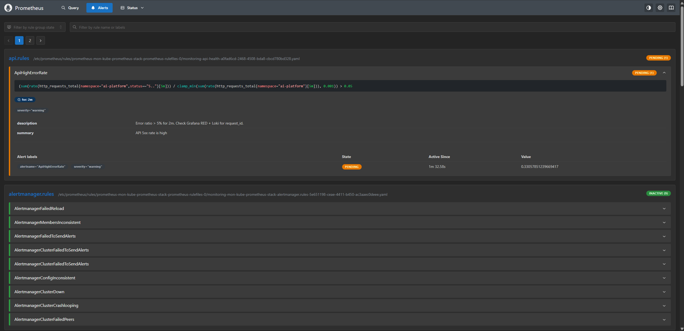
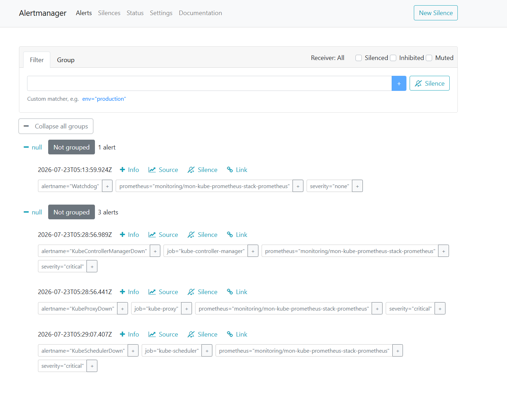
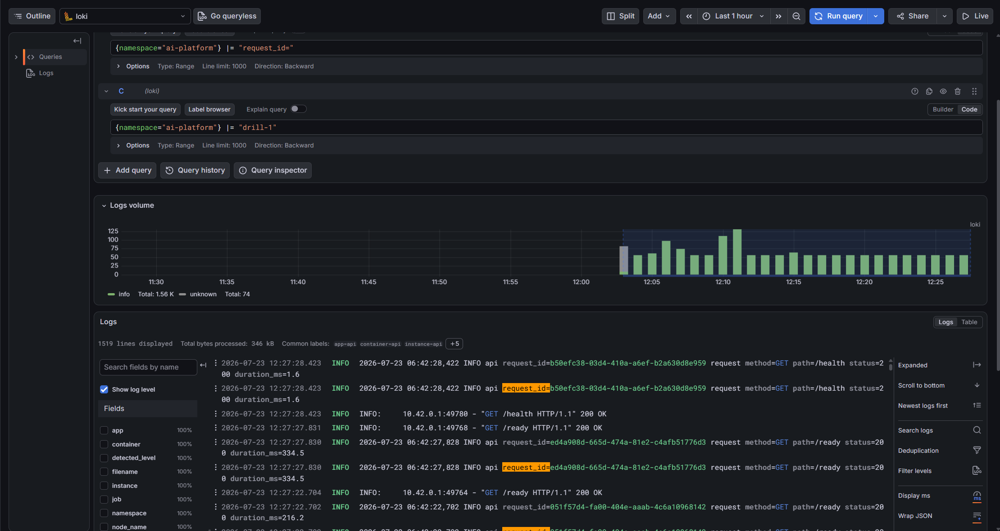

# Cloud Native AI Platform

A cost-bounded platform for a minimal AI summarization API, built with production-oriented patterns: multi-stage containers, Kubernetes probes, Helm packaging, Terraform foundations, GitHub Actions publishing immutable images to GHCR, Argo CD GitOps on a Hetzner VPS, and right-sized observability (Prometheus, Grafana, Loki).

Monthly spend is capped at **$15**. See [docs/cost-budget.md](docs/cost-budget.md).

**Start-to-finish hobby map** (namespaces, charts, every port-forward): [docs/runbooks/hobby-stack.md](docs/runbooks/hobby-stack.md).

## Platform status

| Layer | Status | Delivered |
|-------|--------|-----------|
| API + local dev | Done | FastAPI (`/health`, `/ready`, `/metrics`, `POST /v1/summarize`), Compose, golden-path tests |
| Container image | Done | Multi-stage Dockerfile, non-root runtime |
| Terraform (hobby) | Done | Hetzner VPS (`cnai-hobby`) + firewall; k3s via cloud-init |
| Kubernetes (local) | Done | `kubernetes/base`, liveness/readiness probes. [Runbook](docs/runbooks/app-wont-start.md) |
| Helm | Done | `helm/api` + Bitnami Postgres/Redis. [Runbook](docs/runbooks/helm.md) |
| CI / registry | Done | GitHub Actions: test → build → push to GHCR on `main` |
| GitOps / cloud deploy | Done | Argo CD on k3s; Application watches `helm/api` + `values-hobby.yaml` |
| Observability | Done | kube-prometheus-stack, Loki, Promtail, ServiceMonitor, RED metrics, alert. [monitoring/README.md](monitoring/README.md) |

Operational notes: [docs/lessons-learned.md](docs/lessons-learned.md). GitOps: [gitops/README.md](gitops/README.md). Architecture: [docs/architecture.md](docs/architecture.md).

## Architecture

```
Client → FastAPI (apps/api) → PostgreSQL
                          └→ Redis

GitHub (main) → GHCR image
             └→ Argo CD (k3s on Hetzner) → Helm release in ai-platform

API /metrics → Prometheus → Grafana (RED)
API logs     → Promtail → Loki → Grafana
```

The API exposes standard health and metrics endpoints. LLM calls go through a single `summarize()` abstraction: `stub` in tests/CI, `deepseek` via OpenAI-compatible HTTP when configured. Liveness (`/health`) stays cheap; readiness (`/ready`) gates traffic until Postgres and Redis are reachable.

On the hobby VPS, desired state for the API lives in Git. Argo CD renders the Helm chart and applies it in-cluster — you do not `helm upgrade` the API from the laptop for cloud deploys. Monitoring charts are installed with Helm into `monitoring` (see [monitoring/README.md](monitoring/README.md)).

## Live stack (hobby)

Hetzner VPS `cnai-hobby` — billed while it exists (~$5–12/mo depending on plan):



Argo CD managing the `api` Application (Healthy, path `helm/api`, namespace `ai-platform`):



Grafana (kube-prometheus-stack) — dashboards and Explore for metrics/logs:



Prometheus scraping cluster and app targets (API ServiceMonitor must show **UP**):



Prometheus alert rules (e.g. `ApiHighErrorRate`):



Alertmanager receiving firings:



Loki + Promtail — filter API logs by `request_id` after a forced 500:



## Repository layout

```
apps/api/              FastAPI service, Dockerfile, tests
kubernetes/base/       Raw Kustomize manifests
helm/api/              Application Helm chart (values-local + values-hobby)
gitops/                Argo CD Application manifests
monitoring/            Prometheus/Loki/Promtail values, alerts, RED dashboard
infrastructure/        Terraform modules + hobby environment
.github/workflows/     CI pipeline
docs/                  Runbooks, architecture, cost budget, lessons learned
assets/                Screenshots referenced from this README
```

## Deployment options

| Goal | Path |
|------|------|
| Fastest local loop | Docker Compose (below) |
| Learn raw K8s objects | `kubectl apply -k kubernetes/base` |
| Day-to-day local cluster | Helm + Bitnami. [Runbook](docs/runbooks/helm.md) |
| Cloud (hobby VPS) | Terraform → k3s → Argo CD → monitoring. [hobby-stack.md](docs/runbooks/hobby-stack.md) |

Do not run Compose and a local cluster side by side. Cloud work uses the VPS kubeconfig (`~/.kube/hobby.yaml`), not Docker Desktop.

## Pause, resume, and cost control

The VPS is the only recurring bill (~$6–7/mo typical). GHCR, GitHub Actions free tier, Argo CD, and k3s are $0. Keep the monthly total under **$15**.

### Closing for the day (pick one)

| Intent | Action | Still billed? |
|--------|--------|----------------|
| Short break (hours / overnight) | Hetzner console → power **OFF** on `cnai-hobby` | **Yes** — disk/server reservation still charges |
| Pause multi-day / keep spend flat | `terraform destroy` in `infrastructure/terraform/environments/hobby` | **No** — this is the real off switch |
| Pause > 7 days | Always `terraform destroy` (see [docs/cost-budget.md](docs/cost-budget.md)) | No |

Powering off is convenient but **does not stop the meter**. Deleting the server (Terraform destroy or Hetzner Delete) does.

Before destroy: nothing unique should live only on the box — Git + GHCR are source of truth. After destroy, note spend in [docs/cost-budget.md](docs/cost-budget.md).

```bash
cd infrastructure/terraform/environments/hobby
export HCLOUD_TOKEN=...   # Hetzner API token
terraform destroy
```

### Opening again (same machine, VPS still exists)

1. Hetzner console → power **ON** if you powered off.
2. Confirm your public IP still matches `admin_cidrs` in `terraform.tfvars`. If your ISP changed it, update and `terraform apply` before SSH/kubectl will work (`curl -4 ifconfig.me`).
3. Point kubectl at the hobby cluster and verify:

```bash
./scripts/fetch-hobby-kubeconfig.sh   # or: export KUBECONFIG=~/.kube/hobby.yaml
kubectl get nodes
kubectl -n argocd get pods
kubectl -n argocd port-forward svc/argocd-server 8080:443
# UI: https://localhost:8080
```

### Fresh device → back to the current point

You need: this repo, your SSH **private** key (same key Terraform registered), `HCLOUD_TOKEN`, a GitHub PAT with `read:packages`, and either (A) the existing VPS still running or (B) a willingness to recreate it.

**A — VPS still running (cheaper resume)**

```bash
git clone https://github.com/notsubash/cloud-native-AI-platform.git
cd cloud-native-AI-platform

./scripts/fetch-hobby-kubeconfig.sh
# needs terraform state (or set IP manually — see script / terraform output)

# Argo UI
kubectl -n argocd port-forward svc/argocd-server 8080:443
```

If you lack Terraform state on the new machine, manage the existing server from the Hetzner console (or copy `*.tfstate` from the old laptop). Do not `terraform apply` blindly — it may try to create a second billable server.

**B — Recreate from zero (after destroy, or no state)**

```bash
cd infrastructure/terraform/environments/hobby
cp terraform.tfvars.example terraform.tfvars
# set ssh_public_key_path + admin_cidrs = ["YOUR.IP/32"]  (curl -4 ifconfig.me)
export HCLOUD_TOKEN=...
terraform init && terraform plan && terraform apply

# from repo root — waits for k3s, writes ~/.kube/hobby.yaml with public IP
./scripts/fetch-hobby-kubeconfig.sh

# Install Argo CD, ghcr-pull, api Application — gitops/README.md
# Postgres/Redis + monitoring — docs/runbooks/hobby-stack.md
```

Firewall allows **SSH (22)** and **kubectl (6443)** only from `admin_cidrs`. No SSH tunnel needed when your IP matches.

### Cost hygiene checklist

- [ ] Before leaving for the day: power off **or** destroy (know which you chose).
- [ ] If paused > 7 days: destroy, don’t leave an idle ON server.
- [ ] After destroy: confirm Hetzner console shows **no** `cnai-hobby` server.
- [ ] Never commit `HCLOUD_TOKEN`, `terraform.tfvars`, `*.tfstate`, or the GHCR PAT.
- [ ] Firewall is IP-locked — a new network/café IP blocks SSH/kubectl until you update `admin_cidrs` in `terraform.tfvars` and apply.

## Local development (Compose)

```bash
cp .env.example .env
# Optional: LLM_MODE=deepseek and DEEPSEEK_API_KEY=sk-...
make up
curl -s localhost:8000/health
curl -s localhost:8000/ready
curl -s -X POST localhost:8000/v1/summarize \
  -H 'content-type: application/json' \
  -d '{"text":"Cloud native platforms need boring, reliable plumbing."}'
make test    # stub LLM, no API key required
make down
```

Services: API (`:8000`), Postgres (`:5432`), Redis (`:6379`).

## Kubernetes (Helm)

Prerequisites: Docker Desktop Kubernetes (kubeadm), image built as `cloud-native-ai-api:local`.

```bash
helm upgrade --install api ./helm/api -n ai-platform -f ./helm/api/values-local.yaml
kubectl -n ai-platform port-forward svc/api 8000:8000
```

Upgrade and rollback:

```bash
helm upgrade api ./helm/api -n ai-platform -f ./helm/api/values-local.yaml --set image.tag=local-v2
helm rollback api 1 -n ai-platform
helm history api -n ai-platform
```

Full sequence, DNS notes, and tear-down: [docs/runbooks/helm.md](docs/runbooks/helm.md).

## GitOps (hobby cloud)

Desired state: [gitops/applications/api.yaml](gitops/applications/api.yaml) → chart `helm/api` with [helm/api/values-hobby.yaml](helm/api/values-hobby.yaml) (GHCR image + `ghcr-pull` secret).

App changes go through Git + Argo Sync — not `helm upgrade` on the laptop. Bootstrap, sync, and drift notes: [gitops/README.md](gitops/README.md).

## Observability

| Signal | Stack |
|--------|--------|
| Metrics | kube-prometheus-stack + API `ServiceMonitor` + RED dashboard |
| Logs | Loki + Promtail (`request_id` correlation) |
| Alerts | `monitoring/alerts/api-rules.yaml` → Alertmanager |

Install order, port-forwards, and “find a failed request” drill: [monitoring/README.md](monitoring/README.md).

Import RED dashboard: Grafana → Dashboards → Import → `monitoring/dashboards/api-red.json`.

## CI / container registry

[`.github/workflows/ci.yml`](.github/workflows/ci.yml) runs on pull requests and pushes to `main`:

| Job | Purpose |
|-----|---------|
| `test` | `compileall` + pytest (`apps/api`) |
| `build` | Buildx image build; push to GHCR on `main` only |
| `helm` | `helm lint` + `helm template` (offline chart validation) |

Published image: `ghcr.io/<owner>/cloud-native-ai-api`, tagged `sha-<short>` (immutable) and `latest` on `main`.

Pull after merge:

```bash
gh auth token | docker login ghcr.io -u <owner> --password-stdin
docker pull ghcr.io/<owner>/cloud-native-ai-api:sha-<commit>
```

PR builds validate the Dockerfile without publishing. Cloud deploys consume GHCR via Argo + `values-hobby.yaml`.

## Image build

The API uses a multi-stage Dockerfile: a builder stage installs dependencies into a venv; the runtime stage copies only the venv and application code under a non-root user. Smaller images mean faster CI pulls and a reduced attack surface.
